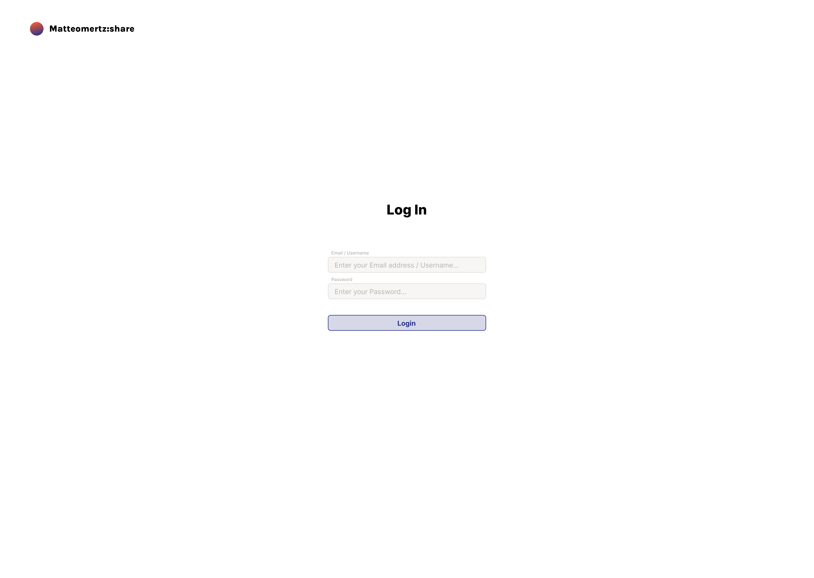
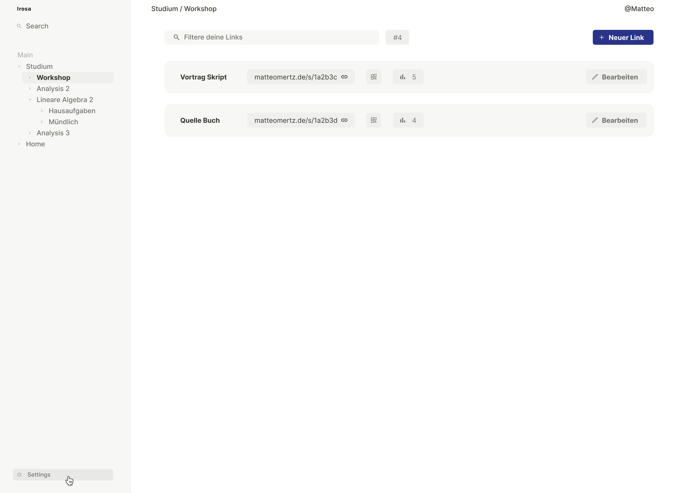
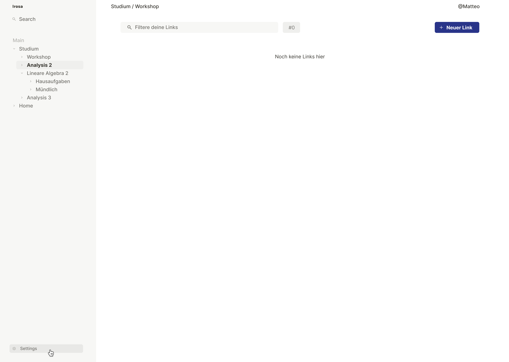
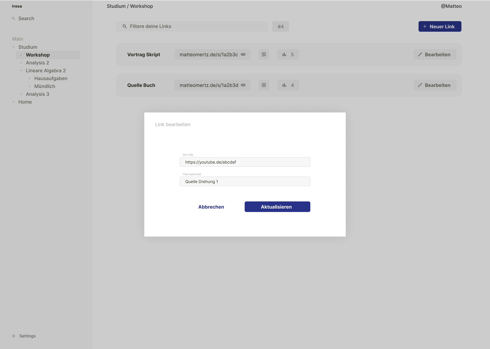
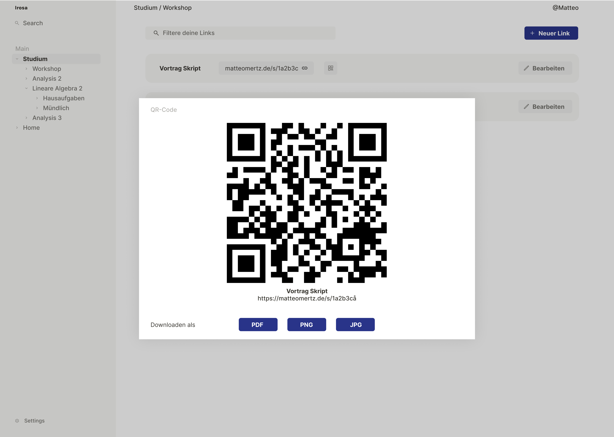
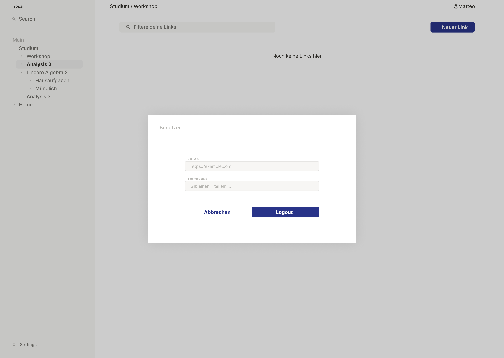
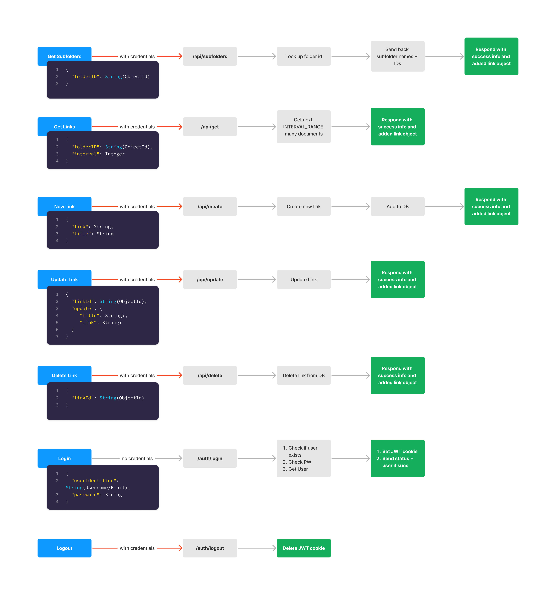
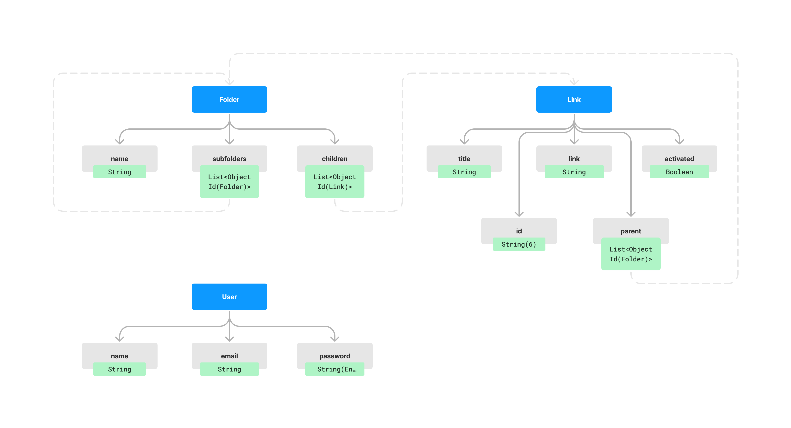

# Mashare

A personal "link-shortener" for `matteomertz.de`. With a dashboard on `share.matteomertz.de`, links can be added and accessed on the route `matteomertz.de/s/<id>`, where `<id>` is the link ID. 

## Design Mockups

## API Endpoints

## Documents
